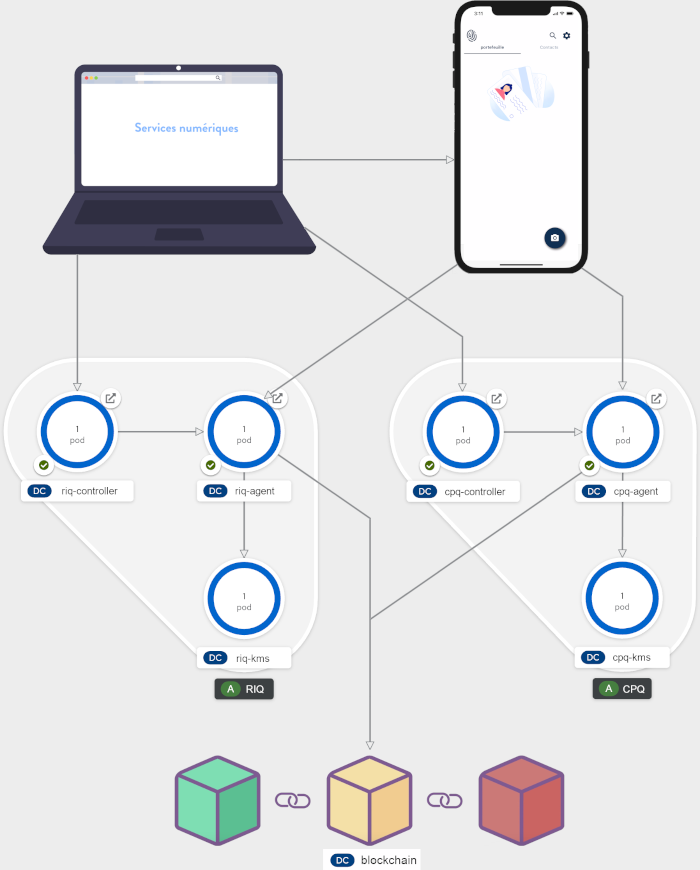
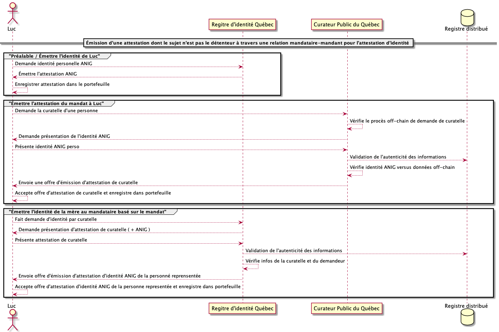

<!-- ENTETE -->
[](https://www.quebec.ca/gouv/politiques-orientations/vitrine-numeriqc/accompagnement-des-organismes-publics/demarche-conception-services-numeriques)
[](LICENSE)

---

<div>
    <a target="_blank" href="https://www.quebec.ca/gouvernement/ministere/cybersecurite-numerique">
      
    </a>
</div>
<!-- FIN ENTETE -->

# Émettre une attestation d\'identité dont le détenteur n'est pas le sujet, par un organisme qui se base sur l\'émission d\'une attestation de mandat d\'un autre organisme

Voici les travaux réalisés dans le cadre d\'une expérimentation basée sur le concept de l\'identité numérique. Le sujet: l\'émission d\'une attestation d\'identité au représentant d\'un individu (sujet) par un organisme émetteur qui ne connaît pas la relation entre ces individus.  

## Table des matières

1. [Objectifs](#10-objectifs)

2. [Contexte](#20-contexte)

3. [Environnement d\'expérimentation](#30-environnement-dexpérimentation)

   1. [Conditions initiales et prémisses](#31-conditions-initiales-et-prémisses)

   2. [Médias standard disponibles](#32-médias-standard-disponibles)

4. [Démarche](#40-démarche)

5. [Attestation d\'identité numérique](#50-le-contenu-de-lattestation)

6. [Résultats attendus](#60-résultats-attendus)

7. [Analyse](#70-analyse)

8. [Conclusion](#80-conclusion)

9. [Licence](#90-licence)
---

## 1.0 Objectifs

- Explorer les concepts techniques permettant de soutenir la relation détenteur-sujet d\'une attestation.

- Évaluer des modèles permettant de soutenir la relation représentant/individu représenté (ou détenteur/sujet)
 pour l\'attestation d\'identité gouvernementale.

## 2.0 Contexte

Le contrôle indirect de l\'identité, soit l'émission d'une attestation
d'un sujet à son représentant, est complexe. Un cas d\'utilisation
minimal a été élaboré afin de permettre la mise en place de toutes les
composantes nécessaires pour expérimenter le concept sans toutefois
régler les contraintes et particularités d\'un cas d\'affaires concret.

> _Solange est atteinte d\'une maladie dégénérative. Ses enfants
> s'entendent afin que Luc, l\'ainé de la famille, soit celui qui veille
> au bien-être et aux affaires de Solange. Luc fait donc une demande
> auprès du tribunal afin d\'être nommé officiellement curateur de
> Solange. Une fois le mandat homologué, Luc fait une demande auprès du
> d\'identité Québec (ou l\'organisme responsable de) pour 
> obtenir l\'attestation d\'identité de sa mère afin de l\'aider à
> obtenir les différents services au nom de cette dernière._

<p align="center">
  

  <br>
  <b>Contexte de l'histoire de Luc et Solange</b>
</p>

1.  Luc fait une demande pour une attestation de mandat auprès du tribunal;

2.  Le tribunal requiert l\'attestation numérique d\'identité de Luc et les documents permettant au tribunal de statuer.

3.  Luc consent à présenter son attestation numérique d\'identité et la documentation;

4.  Le tribunal valide l\'attestation et la documentation;

5.  Le tribunal émet l\'attestation du mandat à Luc;

6.  Le tribunal consigne l\'émission dans le dépôt de clé sécurisé de son agent.

7.  Luc fait une demande pour l\'attestation numérique d\'identité de Solange auprès du Registre d\'identité Québec (RIQ);

8.  Le RIQ requiert l\'attestation numérique d\'identité de Luc et l\'attestation de mandat;

9.  Luc consent à présenter son attestation numérique d\'identité et l\'attestation de mandat;

10. Le RIQ valide les attestations;

11. Le RIQ émet l\'attestation numérique d\'identité de Solange à la Luc;

12. Le RIQ consigne l\'émission dans le dépôt de clé sécurisé de son agent.

## 3.0 Environnement d\'expérimentation

### Construit avec
* [React](https://fr.reactjs.org)

### Prérequis

* [npm](https://www.npmjs.com)
* [docker](https://www.docker.com)
* [von-network](https://github.com/bcgov/von-network)
* [esatus](https://apps.apple.com/ca/app/esatus-wallet/id1496769057), [trinsic](https://apps.apple.com/ca/app/trinsic-wallet/id1475160728)
* [ngrok](https://ngrok.com/)

### Facultatifs

* [VSCode](https://code.visualstudio.com)
* [Debugger for Chrome](https://marketplace.visualstudio.com/items?itemName=msjsdiag.debugger-for-chrome)

### Déploiement
Voir les instructions de [déploiment sur OpenShift](openshift/templates/README.md).


### 3.1 Conditions initiales et prémisses

- Un (1) portefeuille numérique appartenant à Luc est disponible;

- Un répertoire distribué identitaire se conformant au _W3C - VC Data
  Model 1.0_ est en place et permet d\'émettre des attestations ainsi
  que les schémas associés;

- Un émetteur et consommateur d\'attestations d\'identité est en place;

- Un émetteur et consommateur d\'attestations de mandat représentant le
  Tribunal est en place;

- Luc possède déjà son attestation numérique d\'identité au sein d'un portefeuille numérique; 

- La documentation permettant d\'identifier Solange et les preuves
  permettant d\'établir la validité du mandat n'a pas besoin d\'être
  vérifiée;

- Les notifications et publications entre les intervenants ne sont pas
  de la portée de l\'expérimentation. On assume qu'elles sont
  exécutées de manière appropriée lorsque mentionnées;

<p align="center">
  

  <br>
  <b>Schéma des composants utilisés pour réaliser l'expérimentation</b>
</p>

### 3.2 Médias standard disponibles

Quelques médias d\'image standards ont été crées et déposées dans le répertoire [d\'Avatars](./images/Avatar). Ces images peuvent être utilisées dans les formulaires d\'entrée de données de la PES d\'émission d\'attestation.

## 4.0 Démarche

<p align="center">
  

  <br>
  <b>Diagramme de séquence - Démarche</b>
</p>

## 5.0 Le contenu des Attestations

Voici le schéma de données utilisé pour l\'attestation d\'identité numérique ainsi que pour sa délégation:

```json
{
  "schema_name": "Identité Gouvernementale",
  "schema_version": "1.1",
  "attributes": [
    "@context",
    "id",
    "type",
    "credentialSchema",
    "issuanceDate",
    "expirationDate",
    "issuer",
    "trustFramework",
    "credentialSubject.id",
    "credentialSubject.firstNames",
    "credentialSubject.lastName",
    "credentialSubject.birthDate",
    "credentialSubject.birthplace",
    "credentialSubject.gender",
    "credentialSubject.fatherFullName",
    "credentialSubject.motherFullName",
    "credentialSubject.photo"
  ]
}
```

Par exemple, l\'attestation d\'identité de luc pourrait être composée des valeurs suivantes:

| Nom de l'attribut                | Valeurs                                                                                                                                    |
| -------------------------------- | ------------------------------------------------------------------------------------------------------------------------------------------ |
| \@context                        | \[\"https://www.w3.org/2018/credentials/v1\", \"https://iqn-trustframework.apps.exp.lab.pocquebec.org/2020/credentials/iqn/identite/v1\"\] |
| id                               | http://iqn-trustframework.apps.exp.lab.pocquebec.org/2020/credentials/iqn/identite/v1/RegistreIdentite.json                                |
| type                             | \[\"VerifiableCredential\",\"IdentityCredential\"\]                                                                                        |
| credentialSchema                 | V4SGRU86Z58d6TV7PBUe6f:3:CL:1573: Registre_Identite_Qc                                                                                     |
| issuanceDate                     | 2020-11-04T15:40:00Z                                                                                                                       |
| expirationDate                   | 2020-11-04T15:40:00Z                                                                                                                       |
| issuer                           | did:sov: V4SGRU86Z58d6TV7PBUe6f                                                                                                            |
| trustFramework                   | http://iqn-trustframework.apps.exp.lab.pocquebec.org                                                                                       |
| credentialSubject.id             | DID de Luc                                                                                                                                 |
| credentialSubject.firstNames     | Luc                                                                                                                                        |
| credentialSubject.lastName       | Plante                                                                                                                                     |
| credentialSubject.birthDate      | 1976-01-01T20:00:00Z                                                                                                                       |
| credentialSubject.birthplace     | Ville de Québec                                                                                                                            |
| credentialSubject.gender         | Masculin                                                                                                                                   |
| credentialSubject.fatherFullName | Nom complet du père                                                                                                                        |
| credentialSubject.motherFullName | Solange Plante (nom complet de la mère)                                                                                                    |

---

<b>Tableau 1 - Données de l\'attestation d\'identité de Luc</b>

Autre exemple, l\'attestation d\'identité de la mère de luc, Solange, pourrait être composée des valeurs suivantes:

| Nom de l'attribut                | Valeurs                                                                                                                                    |
| -------------------------------- | ------------------------------------------------------------------------------------------------------------------------------------------ |
| \@context                        | \[\"https://www.w3.org/2018/credentials/v1\",\"https://iqn-trustframework.apps.exp.lab.pocquebec.org/2020/credentials/iqn/identite/v1/\"\] |
| id                               | http://iqn-trustframework.apps.exp.lab.pocquebec.org/2020/credentials/iqn/identite/v1/RegistreIdentite.json                                |
| type                             | \[\"VerifiableCredential\",\"IdentityCredential\"\]                                                                                        |
| credentialSchema                 | V4SGRU86Z58d6TV7PBUe6f:3:CL:1573: Registre_Identite_Qc                                                                                     |
| issuanceDate                     | 2020-11-04T15:40:00Z                                                                                                                       |
| expirationDate                   | 2020-11-04T15:40:00Z                                                                                                                       |
| issuer                           | did:sov: V4SGRU86Z58d6TV7PBUe6f                                                                                                            |
| trustFramework                   | http://iqn-trustframework.apps.exp.lab.pocquebec.org                                                                                       |
| credentialSubject.id             | DID de la mère                                                                                                                             |
| credentialSubject.firstNames     | Solange                                                                                                                                    |
| credentialSubject.lastName       | Plante                                                                                                                                     |
| credentialSubject.birthDate      | 1950-01-01T20:00:00Z                                                                                                                       |
| credentialSubject.birthplace     | Ville de Québec                                                                                                                            |
| credentialSubject.gender         | Féminin                                                                                                                                    |
| credentialSubject.fatherFullName | Nom du père                                                                                                                                |
| credentialSubject.motherFullName | Nom de la mère                                                                                                                             |

---

<b>Tableau 2 - Données de l\'attestation d\'identité de Solange</b>

Voici le 2e type de schéma de données utilisé cette fois-ci pour le mandat :

```json
{
  "schema_name": "Mandat de curatelle",
  "schema_version": "1.0",
  "attributes": [
    "@context",
    "id",
    "type",
    "credentialSchema",
    "issuanceDate",
    "expirationDate",
    "issuer",
    "trustFramework",
    "auditURI",
    "appealURI",
    "credentialSubject.holder.type",
    "credentialSubject.holder.role",
    "credentialSubject.holder.rationaleURI",
    "credentialSubject.holder.firstNames",
    "credentialSubject.holder.lastName",
    "credentialSubject.holder.birthDate",
    "credentialSubject.holder.birthplace",
    "credentialSubject.holder.gender",
    "credentialSubject.holder.fatherFullName",
    "credentialSubject.holder.motherFullName",
    "credentialSubject.holder.constraints.boundaries",
    "credentialSubject.holder.constraints.pointOfOrigin",
    "credentialSubject.holder.constraints.radiusKm",
    "credentialSubject.holder.constraints.jurisdictions",
    "credentialSubject.holder.constraints.trigger",
    "credentialSubject.holder.constraints.circumstances",
    "credentialSubject.proxied.type",
    "credentialSubject.proxied.permissions",
    "credentialSubject.proxied.firstNames",
    "credentialSubject.proxied.lastName",
    "credentialSubject.proxied.birthDate",
    "credentialSubject.proxied.birthplace",
    "credentialSubject.proxied.gender",
    "credentialSubject.proxied.fatherFullName",
    "credentialSubject.proxied.motherFullName",
    "credentialSubject.proxied.nativeLanguage",
    "credentialSubject.proxied.identifyingMarks",
    "credentialSubject.proxied.photo",
    "credentialSubject.proxied.iris",
    "credentialSubject.proxied.fingerprint"
  ]
}
```

En exemple, l\'attestation du mandat délivré à luc (détenteur) pour sa mère Solange (sujet) pourrait être composée des valeurs suivantes:

| Nom de l'attribut                                  | Valeurs                                                                                                                               |
| -------------------------------------------------- | ------------------------------------------------------------------------------------------------------------------------------------- |
| \@context                                          | \[\"https://www.w3.org/2018/credentials/v1\", \"https://github.com/hyperledger/aries-rfcs/concepts/0103-indirect-identity-control\"\] |
| id                                                 | http://iqn-trustframework.apps.exp.lab.pocquebec.org/2020/credentials/iqn/delegation/v1/MandatCuratelle.json                          |
| type                                               | \[\"VerifiableCredential\",\"Proxy.G/IQNTrustFrameWork/1.0/AdultGuardaniship\"\]                                                      |
| credentialSchema                                   | V4SGRU86Z58d6TV7PBUe6f:3:CL:1565:IQN-AdultGuardianship                                                                                |
| issuanceDate                                       | 2020-11-04T15:40:00Z                                                                                                                  |
| expirationDate                                     | 2020-11-04T15:40:00Z                                                                                                                  |
| issuer                                             | did:sov: V4SGRU86Z58d6TV7PBUe6f                                                                                                       |
| trustFramework                                     | http://iqn-trustframework.apps.exp.labs.pocquebec.org                                                                                 |
| auditURI                                           | <https://audit.org/report>                                                                                                            |
| appealURI                                          | did:sov:defghijkl                                                                                                                     |
| credentialSubject.holder.type                      | http://iqn-trustframework.apps.exp.lab.Pocquebec.org/2020/credentials/iqn/identite/v1/RegistreIdentite.json                           |
| credentialSubject.holder.role                      | \"parent\" or \"grandparent\" or \"nextofkin\"\ etc                                                                                   |
| credentialSubject.holder.rationaleURI              | N/A                                                                                                                                   |
| credentialSubject.holder.firstNames                | Luc                                                                                                                                   |
| credentialSubject.holder.lastName                  | Plante                                                                                                                                |
| credentialSubject.holder.birthDate                 | 1976-01-01T20:00:00Z                                                                                                                  |
| credentialSubject.holder.birthplace                | Ville de Québec                                                                                                                       |
| credentialSubject.holder.gender                    | Masculin                                                                                                                              |
| credentialSubject.holder.fatherFullName            | Nom complet du père                                                                                                                   |
| credentialSubject.holder.motherFullName            | Solange Plante (nom complet dela mère)                                                                                                |
| credentialSubject.holder.constraints.boundaries    | N/A                                                                                                                                   |
| credentialSubject.holder.constraints.pointOfOrigin | N/A                                                                                                                                   |
| credentialSubject.holder.radiusKM                  | N/A                                                                                                                                   |
| credentialSubject.holder.constraints.jurisdictions | N/A                                                                                                                                   |
| credentialSubject.holder.constraints.trigger       | N/A                                                                                                                                   |
| credentialSubject.holder.constraints.circumstances | N/A                                                                                                                                   |
| credentialSubject.holder.constraints.startTime     | N/A                                                                                                                                   |
| credentialSubject.holder.constraints.endTime       | N/A                                                                                                                                   |
| credentialSubject.proxied.type                     | http://iqn-trustframework.apps.exp.lab.pocquebec.org/2020/credentials/iqn/identite/v1/RegistreIdentite.json                           |
| credentialSubject.proxied.permissions              | {\"grant\": privileges, \"when\": condition}                                                                                          |
| credentialSubject.proxied.firstNames               | Solange                                                                                                                               |
| credentialSubject.proxied.lastName                 | Plante                                                                                                                                |
| credentialSubject.proxied.birthDate                | 1950-01-01T20:00:00Z                                                                                                                  |
| credentialSubject.proxied.birthplace               | Ville de Québec                                                                                                                       |
| credentialSubject.proxied.gender                   | Féminin                                                                                                                               |
| credentialSubject.proxied.fatherFullName           | Nom complet du père                                                                                                                   |
| credentialSubject.proxied.motherFullName           | Nom complet de la mère                                                                                                                |
| credentialSubject.proxied.nativeLanguage           | Français                                                                                                                              |
| credentialSubject.proxied.identifyingMarks         | N/A                                                                                                                                   |
| credentialSubject.proxied.photo                    | N/A                                                                                                                                   |
| credentialSubject.proxied.iris                     | N/A                                                                                                                                   |
| credentialSubject.proxied.fingerprint              | N/A                                                                                                                                   |

---

<b>Tableau 3 - Données de l\'attestation du mandat</b>

## 6.0 Résultats attendus

Deux schémas d\'attestation se retrouvent dans le répertoire de schémas. Ils doivent permettre:

a) Attestation d\'identité

- d\'identifier le sujet de l\'attestation;

b) Attestation de mandat

- d\'identifier la personne responsable dans le mandat (représentant/détenteur)

- d\'identifier la personne dépendante dans le mandat (individu représenté/sujet)

- d\'établir le lien entre la personne responsable et la personne
  dépendante selon les termes consignés dans le mandat

- d\'identifier implicitement la personne responsable comme la
  détentrice de l\'attestation d\'identité de la personne dépendante
  émise par le Registre d'identité Québec.

## 7.0 Analyse

Dans cette expérimentation, la représentation s’effectuait dans un contexte où la personne représentée n’était plus en mesure d’exercer le contrôle de son identité : c’est pour cette raison qu’une personne tierce a été nommée afin de veiller au bien-être du représenté. Il existe d’autres cas de figures où une attestation de représentation peut être émise à un individu sans pour autant que la personne représentée ne soit plus en mesure d’exercer le contrôle de son identité. On peut penser au cas où un avocat représente un client lors d’une transaction commerciale et où les termes de son mandat sont consignés par une attestation.

La présente expérimentation a été inspirée par le Registre d’entreprises instauré par la Colombie-Britannique. Dans cette solution, le Registre d’entreprises émet deux attestations au propriétaire de l’organisation : une qui représente l’organisation elle-même et une qui représente la relation d’autorité entre le propriétaire et l’organisation. Une fois en possession de ces attestations, le propriétaire peut déléguer ses pouvoirs à d’autres personnes (employés, associés, ...) en informant le Registre d’entreprises. Ce dernier émettra alors une attestation qui représente la relation entre les individus nommés et l’organisation.

Il faut noter que dans l’expérimentation et dans l’exemple du Registre d’entreprises de la Colombie-Britannique, la relation entre le représentant et le représenté n’est pas connue a priori de l’organisme émetteur. Cela a pour implication que le demandeur doit être en mesure de démontrer cette relation et que l’organisme émetteur soit en mesure de la valider. Dans un monde idéal, tout pourrait se faire à l’aide d’attestations numériques. Dans la réalité, il est fort possible que des moyens plus traditionnels soient utilisés. En effet, dans l’expérimentation, il aurait été difficile de présenter la décision prise par la famille de Solange sous forme d’attestation numérique : cela impliquerait que la famille est un émetteur de confiance dans l’écosystème et que l’attestation a une valeur légale.

## 8.0 Conclusion

L'expérimentation a permis d'explorer les concepts techniques du contrôle indirect de l'identité, soit l'émission d'une attestation d'un sujet à son représentant. Elle a aussi permis d’évaluer les modèles permettant de soutenir la relation représentant - individu représenté pour une attestation numérique d'identité gouvernementale.

L’attestation vérifiable prouvant le lien entre le représentant et l'individu représenté est émise par une tierce partie qui a les moyens de valider ce dernier et l’autorité de le certifier. Il revient à cette tierce partie d'appliquer ses diverses règles d'affaires aux données qui lui sont soumises avant d’homologuer le mandat.

L’attestation homologuant le mandat devient un moyen pour le représentant d’exécuter son rôle. Comme dans le monde non numérique, le représentant devra prouver qu’il est bien la personne qu’il prétend être et qu’il est mandaté pour agir au nom de la personne représentée. Il revient à l’entité qui doit livrer la prestation de services de valider l’information afin de s’assurer de la conformité du mandat.

La notion de mandat ouvre la porte au concept de représentation dans lequel il est possible que le représentant soit appelé à conserver les attestations de la personne représentée dans son portefeuille numérique. Il faut donc que les portefeuilles offrent les fonctionnalités facilitant la gestion des attestations par le détenteur telles des mécanismes de filtres et de tris. Les versions de portefeuilles utilisées lors des expérimentations ne le permettaient pas mais les avancements dans ce champ de développement laissent croire que ce genre de fonctionnalités pourrait apparaitre d’ici peu.

Finalement, nous constatons que la notion de mandat est relativement simple à porter dans le monde de l’identité numérique dû au fait qu’un mandat est généralement normé avec des règles d’affaires bien précises. Le monde numérique devient un moyen de faciliter l’application de ces dernières.


## 9.0 Licence
Distribué sous Licence Libre du Québec – Réciprocité (LiLiQ-R). Voir [LICENCE](LICENSE) pour plus d'informations.
