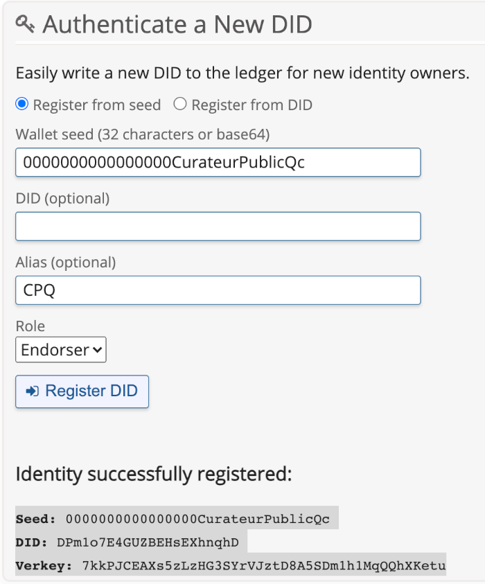

# Demo 2 - Attestation mandatée

l\'environnement d\'expérimentation du CQEN est basé sur AWS & OpenShift (OKD).

Pour reproduire l\'expérimentation vous allez installer les composants suivants:

- une chaîne de bloc (Blockchain)
- un explorateur de bloc (Ledger Client)
- une base de donnée (kms - key management service)
- un agent de communication (Agent)
- un site web comme controlleur (controller)

---

## Configurer le registre distribué

Pour reproduire l\'expérimentation, vous pouvez utiliser un registre distribué déjà installé comme le staging Net de [sovrin](https://sovrin.org) ou vous pouvez vous installer un [VON-Network](https://github.com/bcgov/von-network). C'est un réseau de noeuds Indy de niveau développement comprenant un explorateur de bloc (Ledger Client).

---

## Configurer l\'agent de communication

### [Optionel] Changement des libellés

Si vous souhaitez changer le nom des organismes utilisés dans la démo, vous pouvez spécifier le paramètre "AGENT_NAME" lors du lancement des gabarits de déploiement. Les valeurs par défauts sont "Registre Québec" et "Curateur public du Québec".

### Créer un DID public sur votre chaîne de bloc

Pour que l\'agent de communication puisse émettre des attestations, il est nécessaire de créer un DID public sur votre chaîne de bloc ou réutiliser celui de la démo '0000000000000000CurateurPublicQc'. Si vous avez installé un [VON-Network](https://github.com/bcgov/von-network) de la Province de la Colombie Britannique et que vous avez configurer l\'explorateur de bloc, vous pouvez utiliser son interface graphique pour créer un DID public. Si vous utilisez une autre chaîne de bloc que la votre, vous devrez utiliser les outils fournis pour le faire.

<p align="center">
  

  <br>
  <b>Création d'un DID</b>
</p>

---

## Créer le projet openshift

Vous pouvez procéder par votre interface graphique ou voici la procédure par ligne de commande.

- Authentifiez-vous à OpenShift sur votre terminal, habituellement vous trouverez la ligne de commande à utiliser dans l\'interface graphique

```bash
oc new-project exp-att-man --display-name="Expérimentation Attestation Mandatée" --description="Expérimentation sur l\'Attestation Mandatée en verifiable credential"
```

Assurez-vous d\'êtres sur le bon projet

```bash
oc project exp-att-man
```

---

## Configurer clé d\'accès github (optionel seulement si votre dépôt GitHub est privé)

### Créer le répertoire des clés

Ce répertoire faisant partie du .gitignore vous permettra de ne pas divulger vos paires de clés cryptographiques.

```bash
mkdir .ssh
cd .ssh
```

### Créer les clés de déploiment SSH

```bash
ssh-keygen -C "openshift-source-builder/exp-att-man@github" -f exp-att-man -N ''
```

### Configurer la clé privée de déploiment dans le projet OpenShift

```bash
oc create secret generic exp-att-man --from-file=ssh-privatekey=exp-att-mna --type=kubernetes.io/ssh-auth
```

oc delete secret exp-att-man

```bash
oc secrets link builder exp-att-man
```

### Configurer la clé publique de déploiment dans le projet GitHub

Copier la clé sur Windows

```bash
xclip -sel c < exp-att-man.pub
```

Copier la clé sur Mac OSX

```bash
cat exp-att-man.pub | pbcopy
```

Ouvrir votre dépôt github, le notre est: https://github.com/CQEN-QDCE/exp-attestation-mandatee

- Dans l\'onglet 'Settings',
- sous onglet 'Deploy keys',
  - supprimer la clé nommée 'openshift-source-builder' si elle existe
- Ajouter une clé nommée 'openshift-source-builder'
- et coller le contenu de la clé publique récupérée avec la commande xclip ou pbcopy (CTRL-V) ou (CMD-V)

### Supprimer les fichiers de clés

```
rm exp-att-man && rm exp-att-man.pub
```

> **_NOTE:_** Cette étape sert à ne pas laisser inutilement trainer des informations sensibiles sur votre poste.

---

## Démarrer l\'installation des contrôleurs

```bash
oc process -f openshift/templates/rqc-template.yml -p GITHUB_WEBHOOK_SECRET='$(cat .ssh/exp-att-man)' | oc apply -f -
```

```bash
oc process -f openshift/templates/cpq-template.yml -p GITHUB_WEBHOOK_SECRET='$(cat .ssh/exp-att-man)' | oc apply -f -
```

## Générer les schémas et les définitions d\'attestation sur la chaîne de bloc

### Créer le schéma d\'identité.

> **_NOTE:_** Changer l\'url de l\'agent selon votre installation. Les valeurs "schema_name" et "schema_version" peuvent être modifiées selon vos besoins.

```bash
curl -X POST "http://rqc-agent-admin.apps.exp.lab.pocquebec.org/schemas" -H "accept: application/json" -H "X-Api-Key: " -H "Content-Type: application/json-patch+json" -d "{\"schema_name\": \"Identité Gouvernementale\",\"schema_version\":\"1.0\",\"attributes\":[\"id\",\"type\",\"credentialSchema\",\"issuanceDate\",\"expirationDate\",\"issuer\",\"trustFramework\",\"credentialSubject.id\",\"credentialSubject.firstNames\",\"credentialSubject.lastName\",\"credentialSubject.gender\",\"credentialSubject.birthplace\",\"credentialSubject.birthDate\",\"credentialSubject.fatherFullName\",\"credentialSubject.motherFullName\",\"credentialSubject.photo\"]}"
```

### Créer la définition d\'attestation d\'identité.

> **_NOTE:_** La valeur "schema_id" doit être remplacée par celle obtenue à la sortie de l\'étape précédente.

```bash
curl -X POST "http://rqc-agent-admin.apps.exp.lab.pocquebec.org/credential-definitions" -H "accept: application/json" -H "X-Api-Key: " -H "Content-Type: application/json-patch+json" -d "{\"support_revocation\": false,\"tag\": \"vc-authn-oidc\",\"schema_id\": "G15uJpKsf9JnvYCN54Sd28:2:Identité Gouvernementale:1.0"}"
```

> **_NOTE:_** Conserver la valeur "credential_definition_id"

### Créer le schéma de mandat de curatelle.

> **_NOTE:_** Changer l\'url de l\'agent selon votre installation. Les valeurs "schema_name" et "schema_version" peuvent être modifiées selon vos besoins.

```bash
curl -X POST "http://cpq-agent-admin.apps.exp.lab.pocquebec.org/schemas" -H "accept: application/json" -H "X-Api-Key: " -H "Content-Type: application/json-patch+json" -d "{\"schema_name\": \"Mandat de Curatelle\",\"schema_version\":\"1.0\",\"attributes\":[\"id\",\"type\",\"credentialSchema\",\"issuanceDate\",\"expirationDate\",\"issuer\",\"trustFramework\",\"auditURI\",\"appealURI\",\"credentialSubject.holder.type\",\"credentialSubject.holder.role\",\"credentialSubject.holder.rationaleURI\",\"credentialSubject.holder.firstNames\",\"credentialSubject.holder.lastName\",\"credentialSubject.holder.birthDate\",\"credentialSubject.holder.birthplace\",\"credentialSubject.holder.gender\",\"credentialSubject.holder.fatherFullName\",\"credentialSubject.holder.motherFullName\",\"credentialSubject.holder.constraints.boundaries\",\"credentialSubject.holder.constraints.pointOfOrigin\",\"credentialSubject.holder.constraints.radiusKm\",\"credentialSubject.holder.constraints.jurisdictions\",\"credentialSubject.holder.constraints.trigger\",\"credentialSubject.holder.constraints.circumstances\",\"credentialSubject.proxied.type\",\"credentialSubject.proxied.permissions\",\"credentialSubject.proxied.firstNames\",\"credentialSubject.proxied.lastName\",\"credentialSubject.proxied.birthDate\",\"credentialSubject.proxied.birthplace\",\"credentialSubject.proxied.gender\",\"credentialSubject.proxied.fatherFullName\",\"credentialSubject.proxied.motherFullName\",\"credentialSubject.proxied.nativeLanguage\",\"credentialSubject.proxied.identifyingMarks\",\"credentialSubject.proxied.photo\",\"credentialSubject.proxied.iris\",\"credentialSubject.proxied.fingerprint\"]}"
```

### Créer la définition d\'attestation du mandat de curatelle.

> **_NOTE:_** La valeur "schema_id" doit être remplacée par celle obtenue à la sortie de l\'étape précédente.

```bash
curl -X POST "http://cpq-agent-admin.apps.exp.lab.pocquebec.org/credential-definitions" -H "accept: application/json" -H "X-Api-Key: " -H "Content-Type: application/json-patch+json" -d "{\"support_revocation\": false,\"tag\": \"vc-authn-oidc\",\"schema_id\": \"G15uJpKsf9JnvYCN54Sd28:2:Mandat de Curatelle:1.0\"}"
```

> **_NOTE:_** Conserver la valeur "credential_definition_id"

## Ajustements post déploiment

Certains ajustements supplémentaires sont nécessaires après le premier déploiement. Pour ce faire:

1. Accéder à votre console OpenShift;

2. Sélectionner le projet que vous venez de déployer;

### Ajuster la configuration de l\'application

3. Dans le menu de navigation, ouvrer l\'option "Workloads";

4. Sélectionner l\'option 'Config Maps';

5. Ouvrer 'rqc-controller' en édition;

6. Modifier les valeurs de la clé 'config.js' avec celles générées aux étapes précédentes;

7. Ouvrer 'cpq-controller' en édition;

8. Modifier les valeurs de la clé 'config.js' avec celles générées aux étapes précédentes;

### Ajuster les variables d\'environnement

9. Dans le menu de navigation, dans la section 'Workloads', sélectionner 'Deployment Configs';

10. Sélectionner 'rqc-agent';

11. Dans l\'onglet 'Environment', ajuster les valeurs suivantes:

    - AGENT_DID_SEED -> Valeur d\'initialisation de l\'identitifiant décentralisé public de l\'agent (ex: 0000000000000000CurateurPublicQc)

    - AGENT_DID -> Identitifiant décentralisé public de l\'agent (ex: 23YD3dyHuyFvLpLC3zF58F)

    - GENESIS_FILE_URL -> URL de téléchargement du fichier genesis

    - AGENT_ENDPOINT -> Point de terminaison entrant de l\'agent

    - AGENT_ADMIN_ENDPOINT -> Point de terminaison de l\'agent

12. Sauvegarder;

13. Sélectionner 'rqc-controller';

14. Dans l\'onglet 'Environment', modifier les valeurs suivantes:

    - REACT_APP_ISSUER_HOST_URL -> Url de l\'agent;

15. Sauvegarder;

16. Effectuer les mêmes ajustements pour le 'cpq-agent' et le 'cpq-controller';
